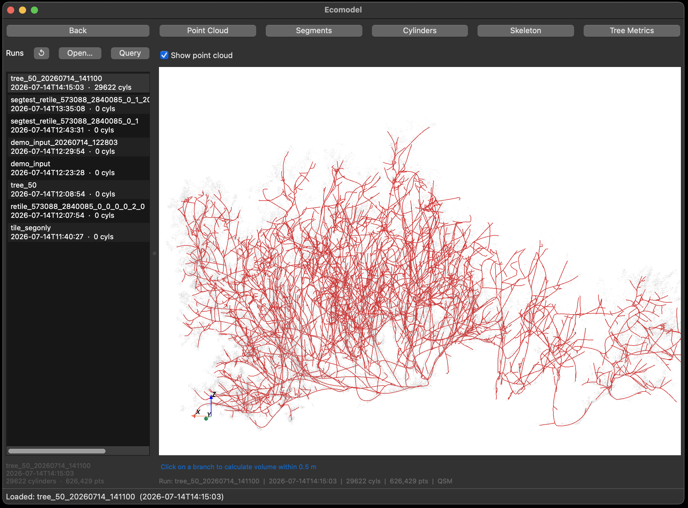
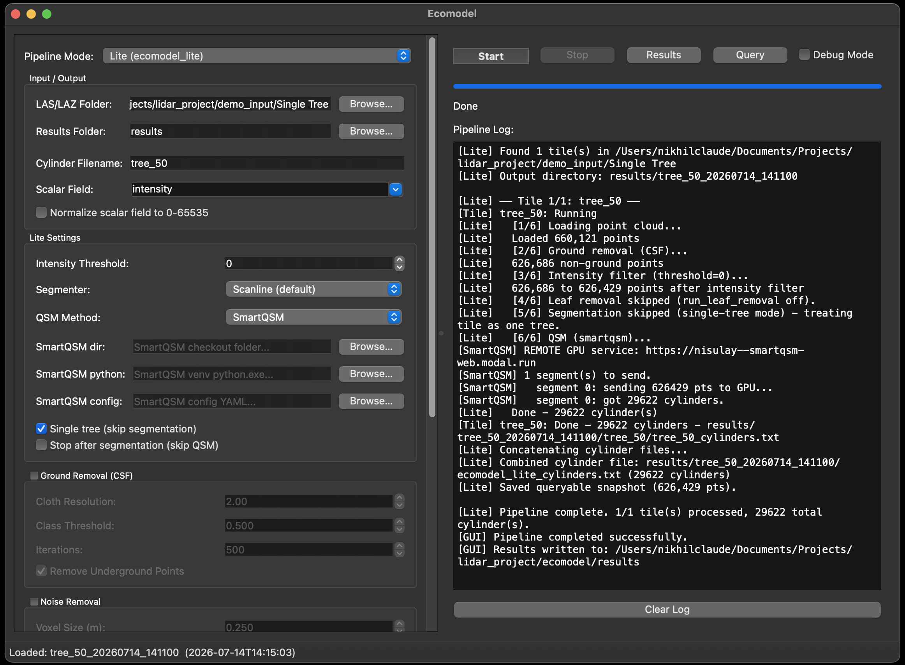
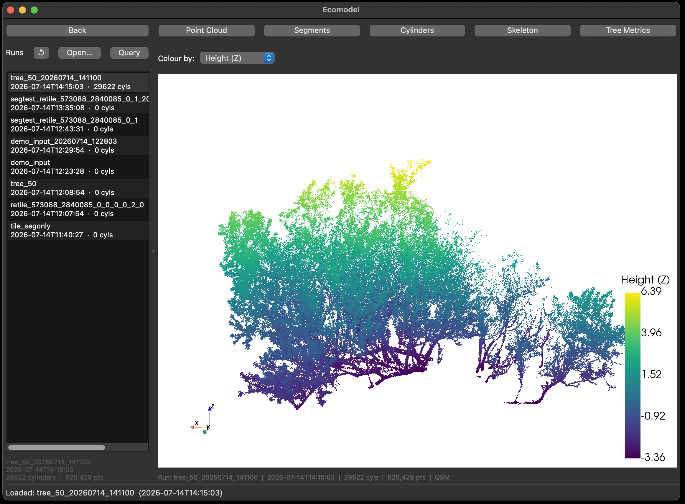
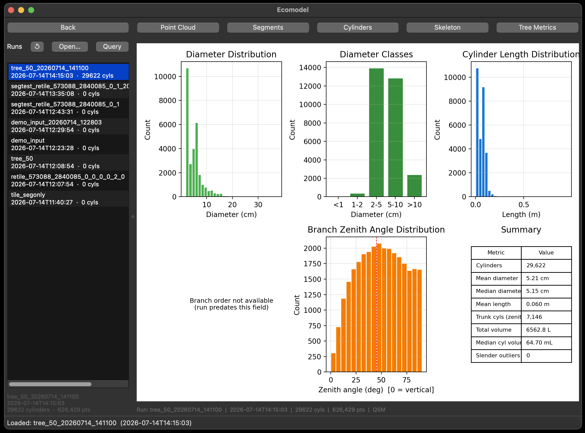

# Ecomodel

Ecomodel turns terrestrial LiDAR scans of forest plots into per-tree structural models.
It takes raw `.las` / `.laz` tiles, removes the ground, separates individual trees, then
fits a Quantitative Structure Model (QSM). A QSM is a cylinder skeleton of every trunk and
branch. You can view it, measure it, and run spatial queries against it in the GUI.

QSM fitting is powered by [TreeQSM](#treeqsm-engine) through the PyTLidar package.

> **Status:** active development. Expect rough edges.



---

## Install

Requires **Python 3.8 to 3.11**. Python 3.12 is not supported because Open3D has no build
for it. We recommend 3.11.

```bash
conda create -n ecomodel python=3.11
conda activate ecomodel

git clone https://github.com/Landscape-CV/Ecomodel.git
cd Ecomodel
pip install -r requirements.txt
```

## Quick start

```bash
python run_gui.py
```

Point **LAS/LAZ Folder** at a directory of tiles, pick a pipeline mode, then press **Start**.

> The pipeline processes **every** `.las` / `.laz` file directly inside that folder.
> Subfolders are ignored. Keep one dataset per folder.



## The pipeline

There are two modes. **Lite** is the CPU pipeline and the one to start with. **Full** is the
larger GPU-accelerated pipeline for big scans.

Lite runs six steps per tile:

| # | Step | Notes |
|---|------|-------|
| 1 | Load & normalise | |
| 2 | Ground removal | Cloth Simulation Filter (CSF) |
| 3 | Intensity filter | drops low-return points |
| 4 | Leaf removal | region-growing (RGI) |
| 5 | Instance segmentation | splits the tile into individual trees |
| 6 | QSM | fits cylinders per tree |

Each stage has its own parameter group in the left-hand panel. Groups are collapsed by
default and use the values shown until you enable them.

## Results

Each run writes a timestamped folder under your results directory. Open it from the
**Results** page to view:

- **Point Cloud**: the processed cloud, coloured by height or intensity
- **Segments**: coloured by tree, for checking segmentation
- **Cylinders / Skeleton**: the fitted QSM
- **Tree Metrics**: per-tree volume, height and branch statistics

**Query** answers spatial questions against a finished run, such as the cylinder volume
within a radius of a point.





## TreeQSM engine

The QSM step is [PyTLidar](https://github.com/Landscape-CV/PyTLidar), a Python port of TreeQSM,
installed from PyPI with the other requirements. It can be used on its own without the GUI:

```bash
python -m PyTLidar.treeqsm file.las --normalize        # single file
python -m PyTLidar.treeqsm_batch folder --normalize    # a folder, in parallel
```

Run with `--help` for the full option list, including patch diameters, optimum-model
selection, output directory and core count. See [Docs](Docs) for the module API and the
metrics definitions.

## Contributing

Bugs and suggestions go in **Issues**. Please check for an existing report first.

For fixes and small features, open a pull request and link it to an issue where you can.
For anything larger, talk to the dev team first so we can plan it together.

## License

GPL-3.0
